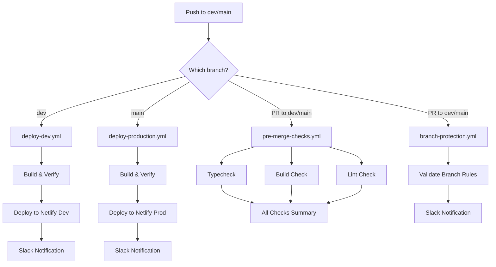

# GitHub Actions Netlify Deployment Setup for testlab-1

## Overview

Replicate the GitHub Actions and Netlify deployment setup from fccOPS and fccCRM projects. This includes:

- Deployment workflows for dev and production
- Pre-merge checks (typecheck, build, lint)
- Branch protection validation
- Slack notifications
- Netlify configuration

## Key Differences from Other Projects

- **Build script**: testlab-1 uses `build` (not `build:client`), but we'll add `build:client` for consistency
- **Build output**: Standard Vite outputs to `dist/` (not `dist/spa/`)
- **App name**: `fcc-testlab` for notifications and site names
- **Missing scripts**: Need to add `typecheck` and potentially `lint` scripts

## Implementation Plan

### 1. Update package.json Scripts

**File**: [`package.json`](package.json)

Add/update scripts to match other projects:

- Add `build:client` script (alias to current `build`)
- Add `typecheck` script: `"typecheck": "tsc --noEmit"`
- Add `lint` script if ESLint is configured (or skip if not needed)
- Update `build` to use `build:client` for consistency

### 2. Create Netlify Configuration

**File**: [`netlify.toml`](netlify.toml) (new file)

Create Netlify config similar to fccOPS:

- Build command: `npm run build:client`
- Publish directory: `dist`
- Node version: 20
- SPA routing redirects
- Functions directory (if needed): `netlify/functions`

### 3. Create GitHub Actions Directory Structure

**Directory**: [`.github/`](.github/) (new)

Create directory structure:

```
.github/
├── actions/
│   └── slack-notify/
│       └── action.yml
└── workflows/
    ├── deploy-dev.yml
    ├── deploy-production.yml
    ├── pre-merge-checks.yml
    └── branch-protection.yml
```

### 4. Create Slack Notification Action

**File**: [`.github/actions/slack-notify/action.yml`](.github/actions/slack-notify/action.yml) (new)

Replicate from fccOPS with app name set to `fcc-testlab`:

- Composite action for Slack notifications
- Supports start, success, failure statuses
- Includes deployment URL, commit info, workflow links

### 5. Create Deployment Workflows

**File**: [`.github/workflows/deploy-dev.yml`](.github/workflows/deploy-dev.yml) (new)

Deploy to development when pushing to `dev` branch:

- Environment: `development`
- Triggers on push to `dev`
- Steps:
  - Checkout code
  - Get commit info
  - Slack notification (start)
  - Setup Node.js 20
  - Install dependencies
  - Build with env var verification
  - Verify build output (check `dist/assets/index-*.js`)
  - Install Netlify CLI
  - Deploy to Netlify (create site if needed)
  - Set Netlify environment variables
  - Slack notification (success/failure)

**Key adaptations for testlab-1**:

- App name: `fcc-testlab`
- Site name: `fcc-testlab-dev`
- Build output path: `dist/` (not `dist/spa/`)
- Build file check: `dist/assets/index-*.js`

**File**: [`.github/workflows/deploy-production.yml`](.github/workflows/deploy-production.yml) (new)

Same structure as dev, but:

- Triggers on push to `main`
- Environment: `production`
- Site name: `fcc-testlab-production`

### 6. Create Pre-Merge Checks Workflow

**File**: [`.github/workflows/pre-merge-checks.yml`](.github/workflows/pre-merge-checks.yml) (new)

Run checks on PRs and pushes to `dev`/`main`:

- **typecheck job**: Run TypeScript type checking
- **build-check job**: Verify build succeeds
- **format-check job**: Check code formatting (optional, continue-on-error)
- **lint-check job**: Run linter and check for console.log/TODO comments
- **all-checks job**: Summary job that fails if required checks fail

**Key adaptations**:

- Use `npm run typecheck` (needs to be added)
- Use `npm run build:client` for build check
- Check for build output in `dist/` directory
- Skip format-check if script doesn't exist (continue-on-error)

### 7. Create Branch Protection Workflow

**File**: [`.github/workflows/branch-protection.yml`](.github/workflows/branch-protection.yml) (new)

Validate PR branch rules:

- PRs to `main` must come from `dev`
- PRs to `dev` are allowed from any branch
- Slack notifications for PR validation
- App name: `fcc-testlab`

### 8. Environment Variables Required

Document required GitHub secrets in deployment guide:

**Development environment**:

- `VITE_SUPABASE_URL`
- `VITE_SUPABASE_ANON_KEY`
- `NETLIFY_AUTH_TOKEN`
- `NETLIFY_SITE_ID` (optional, auto-created)
- `SLACK_WEBHOOK_URL` (for notifications)

**Production environment**:

- Same as development

**Optional**:

- `APP_API_KEY` (if Netlify functions are used)

### 9. Update Documentation

**File**: [`docs/`](docs/) - Add deployment documentation

Create or update:

- Deployment setup guide (similar to fccCRM's DEPLOYMENT_SETUP.md)
- Update QUICK_START.md with deployment info
- Update README.md with deployment section

## Workflow Flow Diagram



## Files to Create/Modify

### New Files

1. `.github/actions/slack-notify/action.yml`
2. `.github/workflows/deploy-dev.yml`
3. `.github/workflows/deploy-production.yml`
4. `.github/workflows/pre-merge-checks.yml`
5. `.github/workflows/branch-protection.yml`
6. `netlify.toml`
7. `docs/DEPLOYMENT_SETUP.md` (optional, for documentation)

### Modified Files

1. `package.json` - Add `build:client` and `typecheck` scripts

## Key Adaptations for testlab-1

1. **Build output**: Use `dist/` (standard Vite) instead of `dist/spa/`
2. **Build file check**: Look for `dist/assets/index-*.js` instead of `dist/spa/assets/index-*.js`
3. **App name**: Use `fcc-testlab` throughout
4. **Site names**: `fcc-testlab-dev` and `fcc-testlab-production`
5. **Scripts**: Add `build:client` and `typecheck` to package.json
6. **Lint**: Make optional if ESLint not configured

## Testing Checklist

After implementation:

- [ ] Verify workflows appear in GitHub Actions
- [ ] Test push to `dev` triggers deploy-dev workflow
- [ ] Test push to `main` triggers deploy-production workflow
- [ ] Test PR triggers pre-merge-checks
- [ ] Verify build output structure matches expectations
- [ ] Check Slack notifications work (if webhook configured)
- [ ] Verify Netlify site creation works
- [ ] Test environment variable embedding in build

## Notes

- All workflows use Node.js 20 (matching other projects)
- Environment variables are embedded during build (Vite requirement)
- Netlify env vars are set for reference but build already has them embedded
- Slack notifications are optional (workflow continues if webhook not set)
- Branch protection validates PR source branches
- Pre-merge checks run on PRs and direct pushes to protected branches